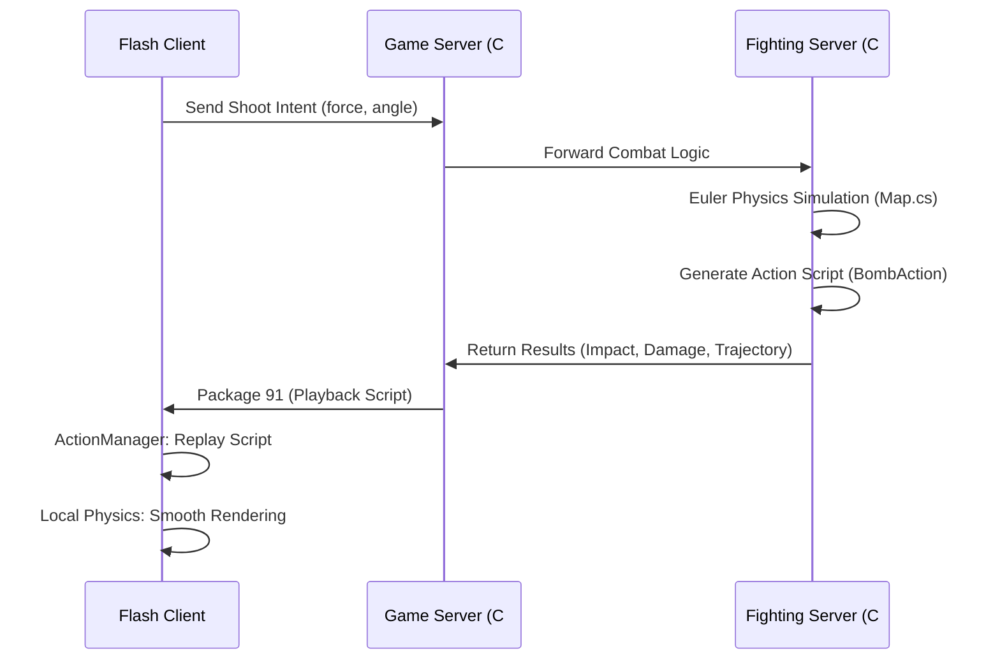
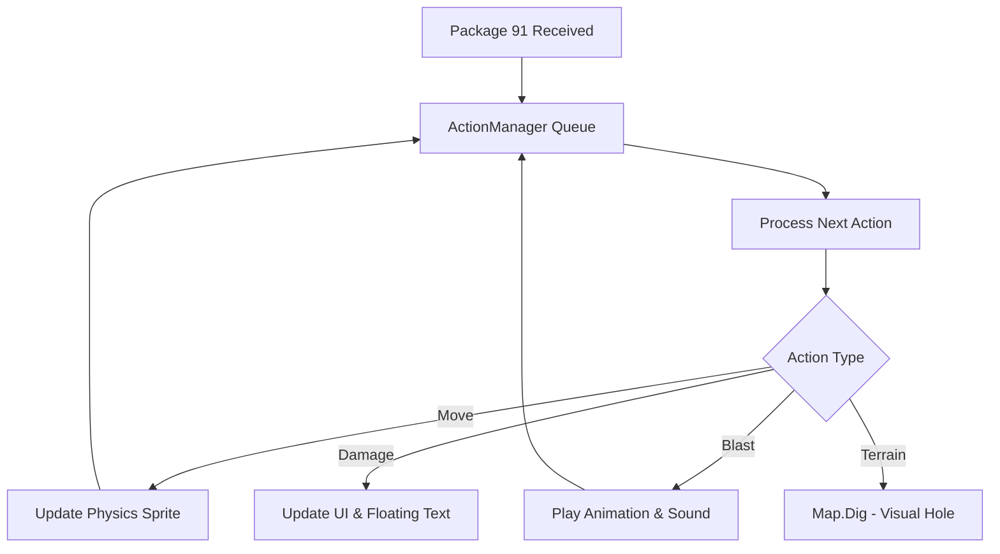

# Frontend Gameplay Architecture - DDTank

This document describes the architecture of the DDTank frontend (Flash client) and its synchronization with the C# backend, focusing on gameplay mechanics, physics, and cross-platform consistency.

## 1. Core Workflow & Synchronization
DDTank uses a **Server-Authoritative** model with **Deterministic Client Playback**. While the client performs physics calculations for visual smoothness, the "source of truth" is the C# backend.

## 2. Shared Physics Logic (C# vs. ActionScript)
The physics logic is mirrored between the ActionScript frontend and the C# backend to ensure consistency.

### ActionScript (`/phy`)
- **`Physics.as`**: Local simulation for smooth rendering.
- **`EulerVector.as`**: Euler integration for frame-by-frame updates.
- **`MapView.as`**: Handles visual terrain destruction (Bitmaps).

### C# Backend (`Game.Logic/Phy`)
- **`Physics.cs`**: Server-side simulation for authority.
- **`EulerVector.cs`**: Exact mathematical mirror of the client's integration.
- **`Map.cs`**: Server-side representation of the terrain (using `Tile` masks instead of Bitmaps).
- **`SimpleBomb.cs`**: Simulates the full flight path and records `BombAction` events for the client.

## 3. The "Playback Script" (Package 91)
When the server finishes its simulation, it sends a packet containing:
1.  **Trajectory Data**: Speed, angle, and starting coordinates.
2.  **Bomb Actions**: A sequence of events recorded during simulation (e.g., hit player, hit wall, explosion, pick up item).
3.  **Calculated Results**: Final damage, health changes, and terrain changes.

The client's `ActionManager` (ActionScript) processes these actions in a queue, ensuring that visuals (animations and sounds) sync perfectly with the server's calculated state.

## 4. Interaction Diagram (Internal Client)

## 5. Key Shared Components
| Feature | ActionScript (Frontend) | C# (Backend) |
| :--- | :--- | :--- |
| **Physics** | `phy.object.Physics` | `Game.Logic.Phy.Object.Physics` |
| **Math** | `phy.math.EulerVector` | `Game.Logic.Phy.Maths.EulerVector` |
| **Bomb** | `game.objects.SimpleBomb` | `Game.Logic.Phy.Object.SimpleBomb` |
| **Map** | `phy.maps.Map` | `Game.Logic.Phy.Maps.Map` |
| **Actions** | `game.actions.ActionManager` | `Game.Logic.Actions.BaseAction` |

## 6. Sound & Visual Triggering
Sound and visual effects are triggered by the `ActionManager` based on the server script.
- **Sound**: Triggered via `SoundManager` when a `COLLIDE` or `BLAST` action is processed.
- **Visuals**: `MovieClipWrapper` handles the playback of complex effects stored in SWF assets.