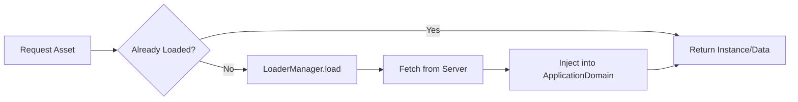
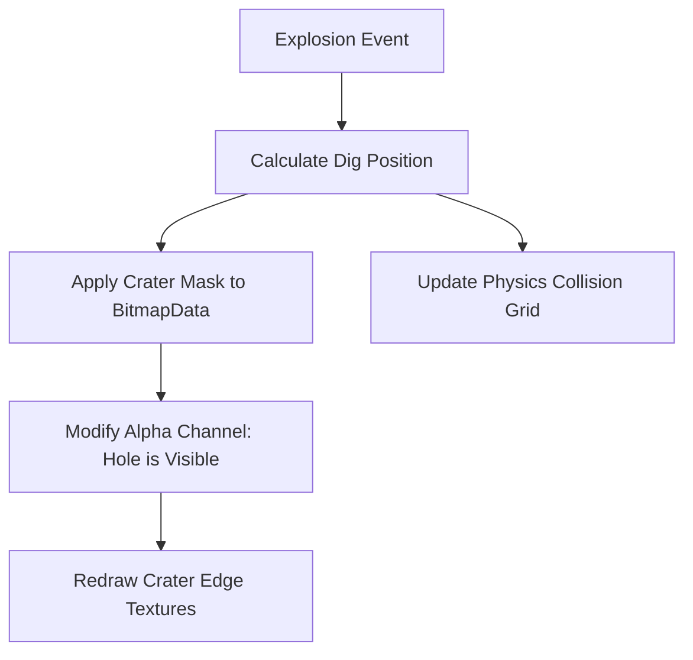

# Frontend Visuals & Image Handling - DDTank

This document provides a deep dive into how the DDTank frontend manages assets, assembles complex characters, and renders the game world.

## 1. Asset Loading Pipeline
DDTank uses a centralized loading system to manage remote SWF, PNG, and XML assets.

- **`LoaderManager` & `ModuleLoader`**: Handles asynchronous loading of assets. It ensures that shared libraries (like common UI or sound effects) are loaded only once.
- **`PathManager`**: Generates full URLs for resources based on the server configuration (e.g., `IMAGE_PATH`, `FLASHSITE`).
- **`ClassUtils`**: Once an SWF is loaded, `ClassUtils.CreatInstance` is used to instantiate exported symbols from the loaded `ApplicationDomain`.

## 2. Character Assembly (`/ddt/view/character`)
Player avatars are not single images; they are composite entities assembled dynamically from dozens of parts.

- **`BaseCharacter`**: The foundation for all player views. It maintains a `_characterBitmapdata` which is a composite canvas.
- **`ICharacterLoader`**: Responsible for loading the specific layers (hair, face, eyes, clothes, weapon).
- **Layering & Blitting**: 
    1. The loader fetches individual PNG/SWF layers.
    2. These layers are drawn (blitted) onto a single `BitmapData` using `draw()`.
    3. The `BaseCharacter` displays this `BitmapData` in a `Bitmap` object.
- **Animation**: `BaseCharacter` uses a grid-based spritesheet approach. It calculates frame offsets (e.g., `_currentframe * _characterWidth`) to show the correct animation frame.

## 3. Map & Terrain Rendering (`/phy/maps`)
The world is a mix of static backgrounds and dynamic, destructible terrain.

- **`MapView` (Layers)**:
    - **`_sky`**: Static background image.
    - **`_middle`**: Optional middle layer for parallax effects.
    - **`_ground` & `_stone`**: The core interactive layers.
- **Bitmaps as Physics Masks**:
    - The `Ground` class uses a `BitmapData` for visuals and a separate internal mask for physics.
    - **`Map.Dig()`**: When an explosion occurs:
        1. A "crater" bitmap is applied to the Ground using `BlendMode.ERASE` (or by modifying the alpha channel).
        2. The physics engine updates its collision map to reflect the new hole.
        3. A "crater brink" (edge texture) is drawn around the hole for visual polish.

## 4. Effect & Particle System (`/par` and `/game/view/effects`)
DDTank uses a combination of frame-based animations and particle emitters.

- **`MovieClipWrapper`**: Wraps Flash's native `MovieClip` to provide better control over playback, events, and disposal.
- **`ParticleEnginee`**: Used for complex effects like smoke, fire, and sparkles. It updates independently of the main physics loop.
- **`ShowEffect`**: A generic class for playing one-off visual effects (like "Level Up" or "Crit Hit") at specific coordinates.

## 5. Performance Optimizations
- **Bitmap Snapping**: Using `PixelSnapping.ALWAYS` to prevent blurriness and reduce sub-pixel calculation overhead.
- **`isLackOfFPS` Detection**: The `Map` class monitors the time between frames. If the client lags (e.g., > 40ms per frame for a sustained period), it sets `_isLackOfFPS = true`, which can be used to disable heavy effects or particles.
- **Disposal**: Strict implementation of the `Disposeable` interface ensures that `BitmapData` and `MovieClip` assets are cleared from memory when a room or game ends.
