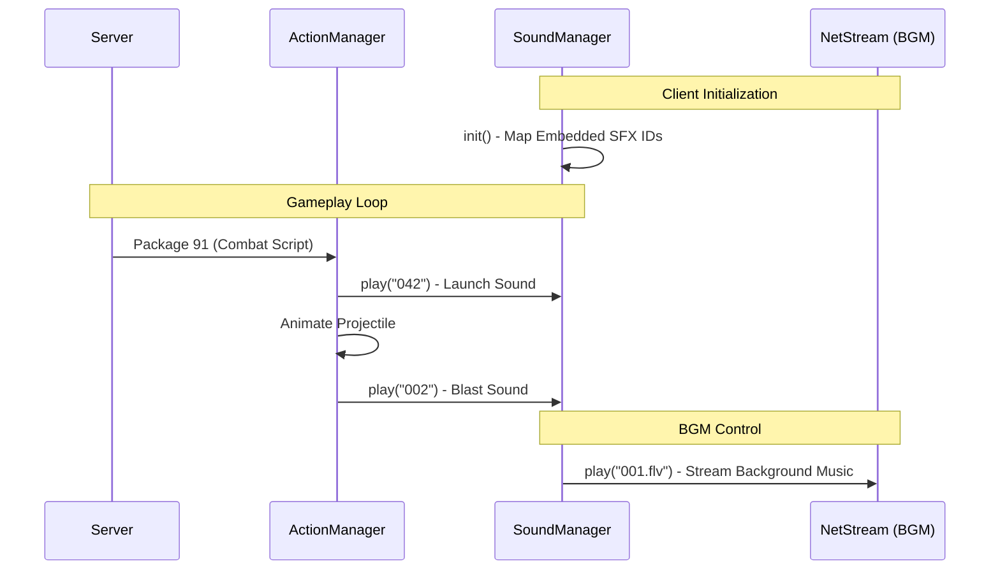

# Sound Architecture - DDTank

This document describes how sound and music are managed, loaded, and triggered in the DDTank frontend.

## 1. Core Sound Infrastructure
DDTank uses two primary managers for audio, both located in the Flash client:
- **`SoundManager.as`**: The main hub for all UI, gameplay, and background music.
- **`CharacterSoundManager.as`**: Specifically handles audio linked to character actions and animations.

## 2. Audio Sources
Sounds are categorized into two types based on their storage and loading method:

### A. Embedded Sound Effects (SFX)
Most short sounds (clicks, explosions, small effects) are embedded within SWF resource files.
- **Loading**: During startup, `SoundManager.init()` maps string IDs (e.g., `"008"`) to Class definitions exported from SWF modules.
- **IDs**:
    - `008`: Standard button click/confirmation (most frequent).
    - `063` / `064`: Win and Lose stings.
    - `044`: Player footstep sound.
    - `014` / `067`: Countdown tick-tocks.

### B. Streamed Background Music (BGM)
To save memory and initial download size, long music tracks are streamed from the server.
- **Format**: `.flv` (Flash Video) files are used as audio containers for streaming.
- **Path**: Resolved via `PathManager.solveFlvSound(id)`, pointing to `http://[resource_server]/sound/[id].flv`.
- **Playback**: Uses `NetStream` for efficient buffering and playback without loading the entire file into RAM.

## 3. Triggering Mechanisms

### UI-Driven (Local)
UI components trigger sounds directly based on user interaction events (MouseClick, RollOver).
```mermaid
graph LR
    A[User Clicks Button] --> B[Event Handler]
    B --> C[SoundManager.play('008')]
```

### Gameplay-Driven (Synchronized)
Gameplay sounds are triggered by the `ActionManager` or specific object lifecycles.
- **Projectile Fire**: `ShootBombAction` triggers `SoundManager.play(info.ShootSound)`.
- **Bomb Impact**: `SimpleBomb` triggers `SoundManager.play(Template.BombSound)` upon collision.
- **Animation Sync**: `MovieClip` animations often have frame-scripts or associated ActionScript logic that calls `CharacterSoundManager.play(action.sound)`.

## 4. Interaction Workflow



## 5. Performance & Configuration
- **Volume Control**: Separate sliders for `Music` and `SFX` are managed in `SoundManager.setConfig`.
- **Optimization**:
    - **SoundChannel Limit**: Flash has a limit of 32 simultaneous sound channels. `SoundManager` manages these to prevent overflow.
    - **Resource Reuse**: SFX are cached once loaded from their respective modules.
    - **Buffer Time**: BGM streaming uses a 0.3s buffer (`NetStream.bufferTime`) to balance latency and stability.

## 6. Asset Origin & Migration (Godot)

### Source Location
- **Original Source**: `Source Flash/FlashSV1/audio.swf`. This is the master container where sounds are stored as Exported Symbols in the Flash library.
- **Extracted Source**: `audio_decomplied/` directory. This is the result of decompiling the SWF for loose asset access.
- **Naming Convention (Decompiled)**: JPEXS exports sounds as `[InternalID]_[ClassName].[Extension]` (e.g., `90_Sound093.mp3`).
- **Mapping Reference**: `audio_decomplied/symbolClass/symbols.csv` contains the link between internal IDs and class names (e.g., `119;"Sound021"`).

### Migration Strategy
1.  **Preparation**:
    -   Identify the sound ID from `BallList.xml` (e.g., `BombSound="093"`).
    -   Locate the matching file in `audio_decomplied/sounds/` (e.g., `90_Sound093.mp3`).
2.  **Renaming**: Rename these files to their pure ID for clean loading in Godot (e.g., `093.mp3`).
3.  **Conversion**: 
    -   Convert `.mp3` to `.wav` for high-frequency SFX (explosions, clicks) to reduce CPU overhead in Godot.
    -   Godot prefers `.ogg` for long music tracks.
4.  **Placement**: Place the final assets in `res://assets/sound/`.
5.  **Implementation**:
    -   The `SoundManager` in Godot should resolve IDs by constructing the path: `$"res://assets/sound/{soundId}.wav"`.
