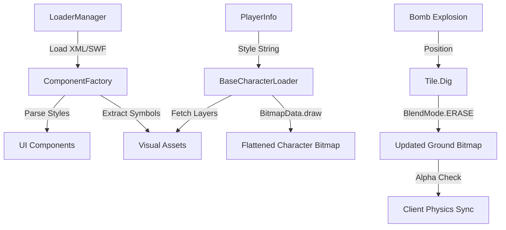

# DDTank Visual & Rendering Architecture (Flash/AS3)

This document details the technical implementation of the DDTank frontend's visual system, asset pipeline, and rendering techniques using ActionScript 3 (AS3).

## 1. Overview
The DDTank client is built on the Flash Player runtime, utilizing a hybrid rendering approach. While it uses the standard Flash **DisplayList** for UI and high-level scene management, the core gameplay (characters and terrain) employs **Bitmap Blitting** for performance optimization.

### Key Technologies:
- **AS3 DisplayList**: Hierarchical management of visual objects (`Sprite`, `MovieClip`, `Bitmap`).
- **BitmapData Blitting**: Manually compositing multiple images into a single `BitmapData` to reduce draw calls.
- **Pickgliss Framework**: A comprehensive utility library providing the loader system, UI components, and resource management.

---

## 2. Asset Loading Pipeline
All game assets (images, SWFs, XML configs, binary data) are managed by the `com.pickgliss.loader` package.

### Loader Types
| Loader Class | Asset Type | Usage |
| :--- | :--- | :--- |
| `BitmapLoader` | PNG, JPG | Raw images, icons. |
| `DisplayLoader` | SWF | Static or simple animated UI assets. |
| `ModuleLoader` | SWF (with code) | Shared libraries containing exported Class definitions. |
| `TextLoader` | XML, TXT | Configuration files (UI styles, item data). |

### The `ModuleLoader` Workflow
1. The client loads a SWF containing multiple visual symbols (e.g., `Armory.swf`).
2. Assets are injected into the `ApplicationDomain.currentDomain`.
3. `ComponentFactory` retrieves these assets by their linkage name (e.g., `asset.game.BombExplosion`) to create instances at runtime.

---

## 3. UI Framework (`com.pickgliss.ui`)
The UI is heavily data-driven, using XML files to define styles, positions, and components.

### `ComponentFactory`
Acts as a central registry. It parses XML "styles" and instantiates components:
- **Styles**: Defined in XML (e.g., `<component classname="..." stylename="..." x="..." y="..." />`).
- **Bitmap Sets**: Maps logical names to SWF symbols or image paths.

### `LayerManager`
Manages the Z-order of the entire application:
- `StageLayer`: Root.
- `GameLayer`: The battle world.
- `UILayer`: Standard interface.
- `PopLayer`: Dialogs and alerts.

---

## 4. Character Rendering (Blitting)
To handle thousands of possible equipment combinations without performance degradation, the game uses a dynamic compositing system.

### `BaseCharacterLoader` Assembly
A character's appearance is a stack of layers ordered from back to front:
1. **Back Hair**
2. **Body**
3. **Face**
4. **Eyes**
5. **Hair**
6. **Clothes**
7. **Suits** (if applicable)
8. **Wings** (rendered as a separate `MovieClip` for animation)

### Dynamic Coloring
The game allows players to customize the color of their hair, eyes, and skin. This is implemented via:
- **`ColorTransform`**: Applied to the layer's bitmap to shift its RGB values.
- **`BlendMode.HARDLIGHT`**: Often used when drawing the colored layer to ensure the underlying texture/shading of the item remains visible while the base color changes.
- **Dyeing System**: Color values are stored as a comma-separated string of hex values in `PlayerInfo.Colors`.

---

## 5. Game World & Destructible Terrain
The battle map is a specialized `Sprite` containing multiple functional layers.

### Map Layers (Z-Order)
- **Sky**: Background image (non-interactive).
- **Middle**: Secondary background (often moves with parallax).
- **Stone**: Non-destructible collision layer.
- **Ground**: The primary destructible terrain.
- **Living Layer**: Characters and NPCs.
- **Phy Layer**: Bullets, explosions, and particle effects.

### Terrain Destruction (`Tile.as`)
Destruction is achieved using Alpha Masking:
1. When a bomb explodes at point `(x, y)`, the client identifies the `Ground` bitmap.
2. It uses `bitmapData.draw(bombShape, matrix, null, BlendMode.ERASE)` where `bombShape` is a bitmap of the crater.
3. This creates "holes" in the terrain by setting the alpha channel to 0.
4. **Collision Sync**: The client uses `getPixel32()` on the `Ground` bitmap to check for transparency (alpha < 150) during local physics prediction.

---

## 6. Performance Monitoring
The `Map.as` class includes a built-in "Lack of FPS" monitor:
- It tracks the time between frames.
- If frame time exceeds **40ms** (below 25 FPS) for several frames:
    - `_isLackOfFPS` is set to `true`.
    - High-cost visual effects (complex particles, alpha blends) are throttled or disabled to maintain gameplay stability.

---

## Visual Rendering Workflow (Mermaid)

